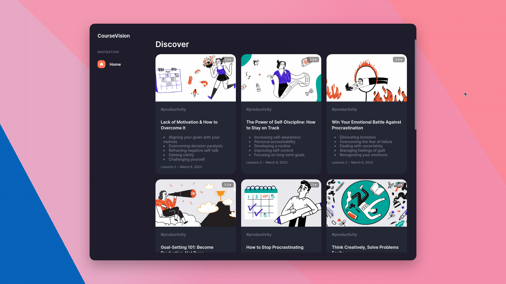
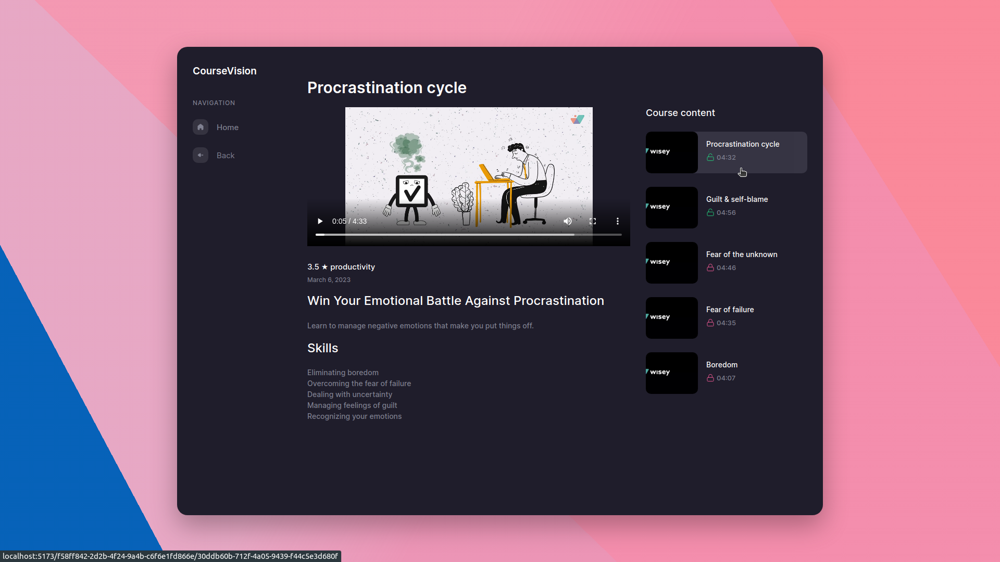
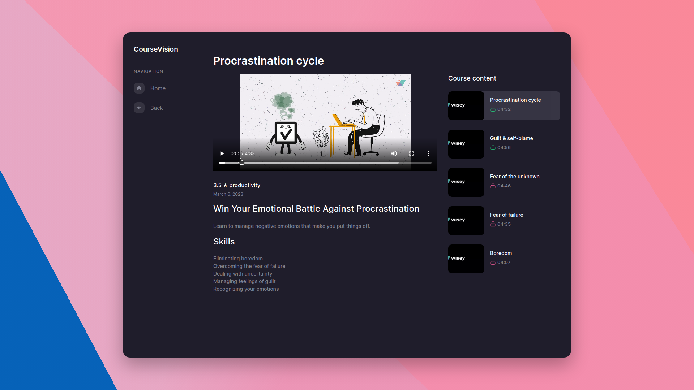
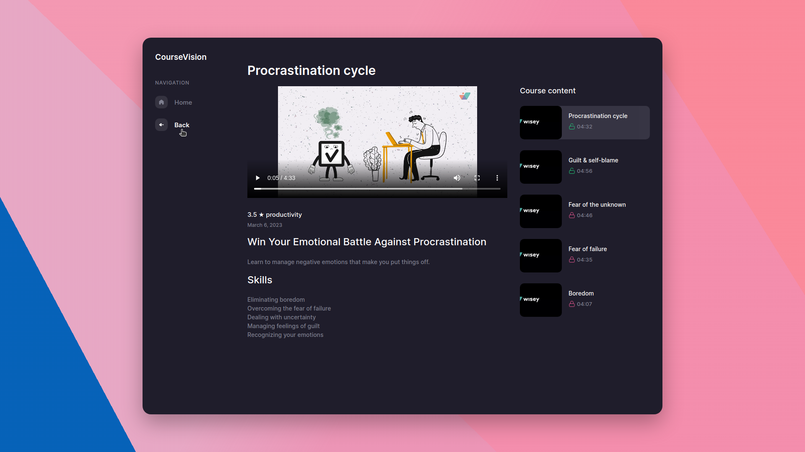

# [Course Vision](https://course-vision.vercel.app/)

Deploy on Vercel - https://course-vision.vercel.app/

## Tech stack

## Scripts

### `npm run dev`

Runs the application in development mode.\
Open [http://localhost:5173](http://localhost:5173) to view it in a browser.

### `npm run build`

Builds an application in a folder `dist`.

## More info

### Home Screen

The list of courses is displayed as cards. A maximum of 3 courses are placed in one row. The card contains the following information:
- Course cover.
- Course title.
- Hashtags.
- List of skills.
- Number of lessons available.
- Download date.

### Home Hover Screen

Hovering over the course map enlarges the image and automatically plays a video trailer without sound.

### Home Pagination Screen

A total of 10 courses are displayed on the main page. There is a pagination at the bottom of the page to view other available courses.

### View Content Screen

You can view all available videos on the course page. The selected video is highlighted in the list. The page contains the following information:
- Name of the lesson.
- Video.
- Rating, hashtag, date.
- Description and list of skills.
- List of all lessons.

### View Controls Screen

By default, there is an option to control the video.
- Playback speed.
- Picture-in-picture mode.
- Zoom to full screen.
- Other.

### View Locked Screen

The list also includes blocked videos. They are marked accordingly.

### View Time Screen

Browsing time is saved when the page is refreshed.

### View Back Screen

There is a Back button. It takes the user one step back.

### Loader Screen

The loader is displayed when data is loaded.

### Not Found Screen

If an error occurs, this component is displayed with a link to the main page.

